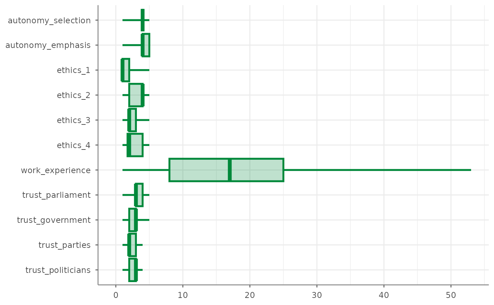
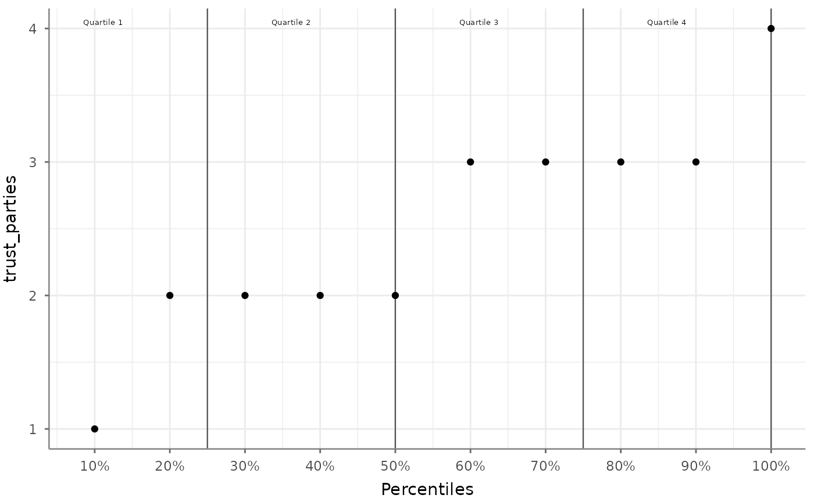
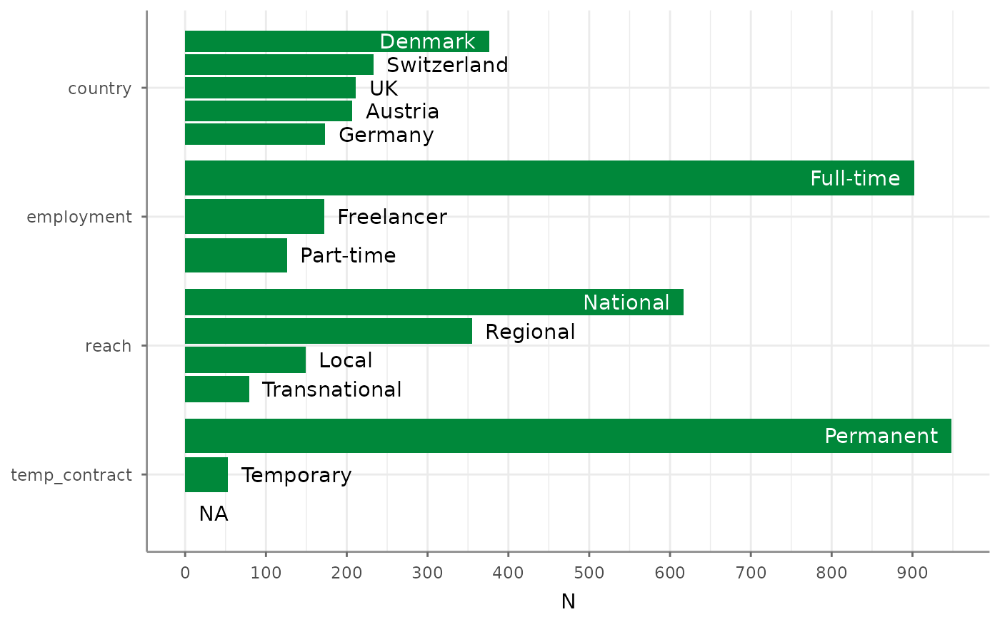
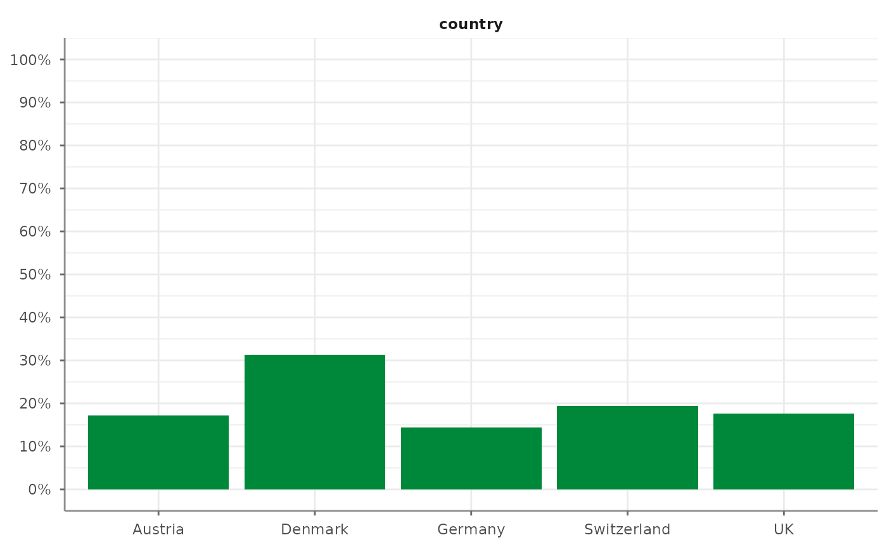

# Univariate analysis of continuous and categorical variables

The first step in data exploration usually consists of univariate,
descriptive analysis of all variables of interest. Tidycomm offers four
basic functions to quickly output relevant statistics:

- [`describe()`](https://github.com/tidycomm/tidycomm/reference/describe.md)
  for continuous variables
- [`tab_percentiles()`](https://github.com/tidycomm/tidycomm/reference/tab_percentiles.md)
  for continuous variables
- [`describe_cat()`](https://github.com/tidycomm/tidycomm/reference/describe_cat.md)
  for categorical variables
- [`tab_frequencies()`](https://github.com/tidycomm/tidycomm/reference/tab_frequencies.md)
  for categorical variables

For demonstration purposes, we will use sample data from the [Worlds of
Journalism](https://worldsofjournalism.org/) 2012-16 study included in
tidycomm.

``` r

WoJ
#> # A tibble: 1,200 × 15
#>    country   reach employment temp_contract autonomy_selection autonomy_emphasis
#>    <fct>     <fct> <chr>      <fct>                      <dbl>             <dbl>
#>  1 Germany   Nati… Full-time  Permanent                      5                 4
#>  2 Germany   Nati… Full-time  Permanent                      3                 4
#>  3 Switzerl… Regi… Full-time  Permanent                      4                 4
#>  4 Switzerl… Local Part-time  Permanent                      4                 5
#>  5 Austria   Nati… Part-time  Permanent                      4                 4
#>  6 Switzerl… Local Freelancer NA                             4                 4
#>  7 Germany   Local Full-time  Permanent                      4                 4
#>  8 Denmark   Nati… Full-time  Permanent                      3                 3
#>  9 Switzerl… Local Full-time  Permanent                      5                 5
#> 10 Denmark   Nati… Full-time  Permanent                      2                 4
#> # ℹ 1,190 more rows
#> # ℹ 9 more variables: ethics_1 <dbl>, ethics_2 <dbl>, ethics_3 <dbl>,
#> #   ethics_4 <dbl>, work_experience <dbl>, trust_parliament <dbl>,
#> #   trust_government <dbl>, trust_parties <dbl>, trust_politicians <dbl>
```

## Describe continuous variables

[`describe()`](https://github.com/tidycomm/tidycomm/reference/describe.md)
outputs several measures of central tendency and variability for all
variables named in the function call:

``` r

WoJ %>%  
  describe(autonomy_selection, autonomy_emphasis, work_experience)
#> # A tibble: 3 × 15
#>   Variable            N Missing     M     SD   Min   Q25   Mdn   Q75   Max Range
#> * <chr>           <int>   <int> <dbl>  <dbl> <dbl> <dbl> <dbl> <dbl> <dbl> <dbl>
#> 1 autonomy_selec…  1197       3  3.88  0.803     1     4     4     4     5     4
#> 2 autonomy_empha…  1195       5  4.08  0.793     1     4     4     5     5     4
#> 3 work_experience  1187      13 17.8  10.9       1     8    17    25    53    52
#> # ℹ 4 more variables: CI_95_LL <dbl>, CI_95_UL <dbl>, Skewness <dbl>,
#> #   Kurtosis <dbl>
```

If no variables are passed to
[`describe()`](https://github.com/tidycomm/tidycomm/reference/describe.md),
all numeric variables in the data are described:

``` r

WoJ %>% 
  describe()
#> # A tibble: 11 × 15
#>    Variable           N Missing     M     SD   Min   Q25   Mdn   Q75   Max Range
#>  * <chr>          <int>   <int> <dbl>  <dbl> <dbl> <dbl> <dbl> <dbl> <dbl> <dbl>
#>  1 autonomy_sele…  1197       3  3.88  0.803     1  4        4     4     5     4
#>  2 autonomy_emph…  1195       5  4.08  0.793     1  4        4     5     5     4
#>  3 ethics_1        1200       0  1.63  0.892     1  1        1     2     5     4
#>  4 ethics_2        1200       0  3.21  1.26      1  2        4     4     5     4
#>  5 ethics_3        1200       0  2.39  1.13      1  2        2     3     5     4
#>  6 ethics_4        1200       0  2.58  1.25      1  1.75     2     4     5     4
#>  7 work_experien…  1187      13 17.8  10.9       1  8       17    25    53    52
#>  8 trust_parliam…  1200       0  3.05  0.811     1  3        3     4     5     4
#>  9 trust_governm…  1200       0  2.82  0.854     1  2        3     3     5     4
#> 10 trust_parties   1200       0  2.42  0.736     1  2        2     3     4     3
#> 11 trust_politic…  1200       0  2.52  0.712     1  2        3     3     4     3
#> # ℹ 4 more variables: CI_95_LL <dbl>, CI_95_UL <dbl>, Skewness <dbl>,
#> #   Kurtosis <dbl>
```

Data can be grouped before describing:

``` r

WoJ %>%  
  dplyr::group_by(country) %>% 
  describe(autonomy_emphasis, autonomy_selection)
#> # A tibble: 10 × 16
#> # Groups:   country [5]
#>    country     Variable      N Missing     M    SD   Min   Q25   Mdn   Q75   Max
#>  * <fct>       <chr>     <int>   <int> <dbl> <dbl> <dbl> <dbl> <dbl> <dbl> <dbl>
#>  1 Austria     autonomy…   205       2  4.19 0.614     2     4     4     5     5
#>  2 Denmark     autonomy…   375       1  3.90 0.856     1     4     4     4     5
#>  3 Germany     autonomy…   172       1  4.34 0.818     1     4     5     5     5
#>  4 Switzerland autonomy…   233       0  4.07 0.694     1     4     4     4     5
#>  5 UK          autonomy…   210       1  4.08 0.838     2     4     4     5     5
#>  6 Austria     autonomy…   207       0  3.92 0.637     2     4     4     4     5
#>  7 Denmark     autonomy…   376       0  3.76 0.892     1     3     4     4     5
#>  8 Germany     autonomy…   172       1  3.97 0.881     1     3     4     5     5
#>  9 Switzerland autonomy…   233       0  3.92 0.628     1     4     4     4     5
#> 10 UK          autonomy…   209       2  3.91 0.867     1     3     4     5     5
#> # ℹ 5 more variables: Range <dbl>, CI_95_LL <dbl>, CI_95_UL <dbl>,
#> #   Skewness <dbl>, Kurtosis <dbl>
```

The returning results from
[`describe()`](https://github.com/tidycomm/tidycomm/reference/describe.md)
can also be visualized:

``` r

WoJ %>% 
  describe() %>% 
  visualize()
```



In addition, percentiles can easily be extracted from continuous
variables:

``` r

WoJ %>% 
  tab_percentiles()
#> # A tibble: 11 × 11
#>    Variable            p10   p20   p30   p40   p50   p60   p70   p80   p90  p100
#>  * <chr>             <dbl> <dbl> <dbl> <dbl> <dbl> <dbl> <dbl> <dbl> <dbl> <dbl>
#>  1 autonomy_selecti…     3     3     4     4     4     4     4     4     5     5
#>  2 autonomy_emphasis     3     4     4     4     4     4     4     5     5     5
#>  3 ethics_1              1     1     1     1     1     2     2     2     3     5
#>  4 ethics_2              1     2     2     3     4     4     4     4     5     5
#>  5 ethics_3              1     1     2     2     2     2     3     4     4     5
#>  6 ethics_4              1     1     2     2     2     3     3     4     4     5
#>  7 work_experience       4     7    10    14    17    20    25    28    33    53
#>  8 trust_parliament      2     2     3     3     3     3     3     4     4     5
#>  9 trust_government      2     2     2     3     3     3     3     4     4     5
#> 10 trust_parties         1     2     2     2     2     3     3     3     3     4
#> 11 trust_politicians     2     2     2     2     3     3     3     3     3     4
```

Percentiles can also be visualized:

``` r

WoJ %>% 
  tab_percentiles(trust_parties) %>% 
  visualize()
#> Warning: Using `size` aesthetic for lines was deprecated in ggplot2 3.4.0.
#> ℹ Please use `linewidth` instead.
#> ℹ The deprecated feature was likely used in the tidycomm package.
#>   Please report the issue at <https://github.com/tidycomm/tidycomm/issues>.
#> This warning is displayed once per session.
#> Call `lifecycle::last_lifecycle_warnings()` to see where this warning was
#> generated.
```



## Describe categorical variables

[`describe_cat()`](https://github.com/tidycomm/tidycomm/reference/describe_cat.md)
outputs a short summary of categorical variables (number of unique
values, mode, N of mode) of all variables named in the function call:

``` r

WoJ %>% 
  describe_cat(reach, employment, temp_contract)
#> # A tibble: 3 × 6
#>   Variable          N Missing Unique Mode      Mode_N
#> * <chr>         <int>   <int>  <dbl> <chr>      <int>
#> 1 reach          1200       0      4 National     617
#> 2 employment     1200       0      3 Full-time    902
#> 3 temp_contract  1001     199      2 Permanent    948
```

If no variables are passed to
[`describe_cat()`](https://github.com/tidycomm/tidycomm/reference/describe_cat.md),
all categorical variables (i.e., `character` and `factor` variables) in
the data are described:

``` r

WoJ %>% 
  describe_cat()
#> # A tibble: 4 × 6
#>   Variable          N Missing Unique Mode      Mode_N
#> * <chr>         <int>   <int>  <dbl> <chr>      <int>
#> 1 country        1200       0      5 Denmark      376
#> 2 reach          1200       0      4 National     617
#> 3 employment     1200       0      3 Full-time    902
#> 4 temp_contract  1001     199      2 Permanent    948
```

Data can be grouped before describing:

``` r

WoJ %>% 
  dplyr::group_by(reach) %>% 
  describe_cat(country, employment)
#> # A tibble: 8 × 7
#> # Groups:   reach [4]
#>   reach         Variable       N Missing Unique Mode        Mode_N
#> * <fct>         <chr>      <int>   <int>  <dbl> <chr>        <int>
#> 1 Local         country      149       0      5 Germany         47
#> 2 Regional      country      355       0      5 Switzerland     90
#> 3 National      country      617       0      5 Denmark        262
#> 4 Transnational country       79       0      4 UK              72
#> 5 Local         employment   149       0      3 Full-time      111
#> 6 Regional      employment   355       0      3 Full-time      287
#> 7 National      employment   617       0      3 Full-time      438
#> 8 Transnational employment    79       0      3 Full-time       66
```

Again, also the results from
[`describe_cat()`](https://github.com/tidycomm/tidycomm/reference/describe_cat.md)
can be visualized like so:

``` r

WoJ %>% 
  describe_cat() %>% 
  visualize()
```



## Tabulate frequencies of categorical variables

[`tab_frequencies()`](https://github.com/tidycomm/tidycomm/reference/tab_frequencies.md)
outputs absolute and relative frequencies of all unique values of one or
more categorical variables:

``` r

WoJ %>%  
  tab_frequencies(employment)
#> # A tibble: 3 × 5
#>   employment     n percent cum_n cum_percent
#> * <chr>      <int>   <dbl> <int>       <dbl>
#> 1 Freelancer   172   0.143   172       0.143
#> 2 Full-time    902   0.752  1074       0.895
#> 3 Part-time    126   0.105  1200       1
```

Passing more than one variable will compute relative frequencies based
on all combinations of unique values:

``` r

WoJ %>%  
  tab_frequencies(employment, country)
#> # A tibble: 15 × 6
#>    employment country         n percent cum_n cum_percent
#>  * <chr>      <fct>       <int>   <dbl> <int>       <dbl>
#>  1 Freelancer Austria        16 0.0133     16      0.0133
#>  2 Freelancer Denmark        85 0.0708    101      0.0842
#>  3 Freelancer Germany        29 0.0242    130      0.108 
#>  4 Freelancer Switzerland    10 0.00833   140      0.117 
#>  5 Freelancer UK             32 0.0267    172      0.143 
#>  6 Full-time  Austria       165 0.138     337      0.281 
#>  7 Full-time  Denmark       275 0.229     612      0.51  
#>  8 Full-time  Germany       139 0.116     751      0.626 
#>  9 Full-time  Switzerland   154 0.128     905      0.754 
#> 10 Full-time  UK            169 0.141    1074      0.895 
#> 11 Part-time  Austria        26 0.0217   1100      0.917 
#> 12 Part-time  Denmark        16 0.0133   1116      0.93  
#> 13 Part-time  Germany         5 0.00417  1121      0.934 
#> 14 Part-time  Switzerland    69 0.0575   1190      0.992 
#> 15 Part-time  UK             10 0.00833  1200      1
```

You can also group your data before. This will lead to within-group
relative frequencies:

``` r

WoJ %>% 
  dplyr::group_by(country) %>%  
  tab_frequencies(employment)
#> # A tibble: 15 × 6
#> # Groups:   country [5]
#>    employment country         n percent cum_n cum_percent
#>  * <chr>      <fct>       <int>   <dbl> <int>       <dbl>
#>  1 Freelancer Austria        16  0.0773    16      0.0773
#>  2 Full-time  Austria       165  0.797    181      0.874 
#>  3 Part-time  Austria        26  0.126    207      1     
#>  4 Freelancer Denmark        85  0.226     85      0.226 
#>  5 Full-time  Denmark       275  0.731    360      0.957 
#>  6 Part-time  Denmark        16  0.0426   376      1     
#>  7 Freelancer Germany        29  0.168     29      0.168 
#>  8 Full-time  Germany       139  0.803    168      0.971 
#>  9 Part-time  Germany         5  0.0289   173      1     
#> 10 Freelancer Switzerland    10  0.0429    10      0.0429
#> 11 Full-time  Switzerland   154  0.661    164      0.704 
#> 12 Part-time  Switzerland    69  0.296    233      1     
#> 13 Freelancer UK             32  0.152     32      0.152 
#> 14 Full-time  UK            169  0.801    201      0.953 
#> 15 Part-time  UK             10  0.0474   211      1
```

(Compare the columns `percent`, `cum_n` and `cum_percent` with the
output above.)

And of course, also
[`tab_frequencies()`](https://github.com/tidycomm/tidycomm/reference/tab_frequencies.md)
can easily be visualized:

``` r

WoJ %>% 
  tab_frequencies(country) %>% 
  visualize()
```


