# Bivariate analysis of continuous and/or categorical variables

Tidycomm includes five functions for bivariate explorative data
analysis:

- [`crosstab()`](https://github.com/tidycomm/tidycomm/reference/crosstab.md)
  for both categorical independent and dependent variables
- [`t_test()`](https://github.com/tidycomm/tidycomm/reference/t_test.md)
  for dichotomous categorical independent and continuous dependent
  variables
- [`unianova()`](https://github.com/tidycomm/tidycomm/reference/unianova.md)
  for polytomous categorical independent and continuous dependent
  variables
- [`correlate()`](https://github.com/tidycomm/tidycomm/reference/correlate.md)
  for both continuous independent and dependent variables
- [`regress()`](https://github.com/tidycomm/tidycomm/reference/regress.md)
  for both continuous or factorial (translated into dummy dichotomous
  versions) independent and continuous dependent variables

We will again use sample data from the [Worlds of
Journalism](https://worldsofjournalism.org/) 2012-16 study for
demonstration purposes:

``` r

WoJ
#> # A tibble: 1,200 × 15
#>    country   reach employment temp_contract autonomy_selection autonomy_emphasis
#>    <fct>     <fct> <chr>      <fct>                      <dbl>             <dbl>
#>  1 Germany   Nati… Full-time  Permanent                      5                 4
#>  2 Germany   Nati… Full-time  Permanent                      3                 4
#>  3 Switzerl… Regi… Full-time  Permanent                      4                 4
#>  4 Switzerl… Local Part-time  Permanent                      4                 5
#>  5 Austria   Nati… Part-time  Permanent                      4                 4
#>  6 Switzerl… Local Freelancer NA                             4                 4
#>  7 Germany   Local Full-time  Permanent                      4                 4
#>  8 Denmark   Nati… Full-time  Permanent                      3                 3
#>  9 Switzerl… Local Full-time  Permanent                      5                 5
#> 10 Denmark   Nati… Full-time  Permanent                      2                 4
#> # ℹ 1,190 more rows
#> # ℹ 9 more variables: ethics_1 <dbl>, ethics_2 <dbl>, ethics_3 <dbl>,
#> #   ethics_4 <dbl>, work_experience <dbl>, trust_parliament <dbl>,
#> #   trust_government <dbl>, trust_parties <dbl>, trust_politicians <dbl>
```

## Compute contingency tables and Chi-square tests

[`crosstab()`](https://github.com/tidycomm/tidycomm/reference/crosstab.md)
outputs a contingency table for one independent (column) variable and
one or more dependent (row) variables:

``` r

WoJ %>% 
  crosstab(reach, employment)
#> # A tibble: 3 × 5
#>   employment Local Regional National Transnational
#> * <chr>      <dbl>    <dbl>    <dbl>         <dbl>
#> 1 Freelancer    23       36      104             9
#> 2 Full-time    111      287      438            66
#> 3 Part-time     15       32       75             4
```

Additional options include `add_total` (adds a row-wise `Total` column
if set to `TRUE`) and `percentages` (outputs column-wise percentages
instead of absolute values if set to `TRUE`):

``` r

WoJ %>% 
  crosstab(reach, employment, add_total = TRUE, percentages = TRUE)
#> # A tibble: 3 × 6
#>   employment Local Regional National Transnational Total
#> * <chr>      <dbl>    <dbl>    <dbl>         <dbl> <dbl>
#> 1 Freelancer 0.154   0.101     0.169        0.114  0.143
#> 2 Full-time  0.745   0.808     0.710        0.835  0.752
#> 3 Part-time  0.101   0.0901    0.122        0.0506 0.105
```

Setting `chi_square = TRUE` computes a $`\chi^2`$ test including
Cramer’s $`V`$ and outputs the results in a console message:

``` r

WoJ %>% 
  crosstab(reach, employment, chi_square = TRUE)
#> # A tibble: 3 × 5
#>   employment Local Regional National Transnational
#> * <chr>      <dbl>    <dbl>    <dbl>         <dbl>
#> 1 Freelancer    23       36      104             9
#> 2 Full-time    111      287      438            66
#> 3 Part-time     15       32       75             4
#> # Chi-square = 16.005, df = 6, p = 0.014, V = 0.082
```

Finally, passing multiple row variables will treat all unique value
combinations as a single variable for percentage and Chi-square
computations:

``` r

WoJ %>% 
  crosstab(reach, employment, country, percentages = TRUE)
#> # A tibble: 15 × 6
#>    employment country       Local Regional National Transnational
#>  * <chr>      <fct>         <dbl>    <dbl>    <dbl>         <dbl>
#>  1 Freelancer Austria     0.0134   0.0113   0.0162         0     
#>  2 Freelancer Denmark     0.0537   0.0197   0.112          0.0127
#>  3 Freelancer Germany     0.0470   0.0507   0.00648        0     
#>  4 Freelancer Switzerland 0.0403   0.00845  0.00162        0     
#>  5 Freelancer UK          0        0.0113   0.0324         0.101 
#>  6 Full-time  Austria     0.0403   0.180    0.152          0.0127
#>  7 Full-time  Denmark     0.168    0.192    0.295          0     
#>  8 Full-time  Germany     0.268    0.172    0.0616         0     
#>  9 Full-time  Switzerland 0.168    0.197    0.0875         0.0633
#> 10 Full-time  UK          0.101    0.0676   0.113          0.759 
#> 11 Part-time  Austria     0        0.0225   0.0292         0     
#> 12 Part-time  Denmark     0.00671  0.0113   0.0178         0     
#> 13 Part-time  Germany     0        0.00282  0.00648        0     
#> 14 Part-time  Switzerland 0.0872   0.0479   0.0632         0     
#> 15 Part-time  UK          0.00671  0.00563  0.00486        0.0506
```

You can also visualize the output from
[`crosstab()`](https://github.com/tidycomm/tidycomm/reference/crosstab.md):

``` r

WoJ %>% 
  crosstab(reach, employment, percentages = TRUE) %>% 
  visualize()
```

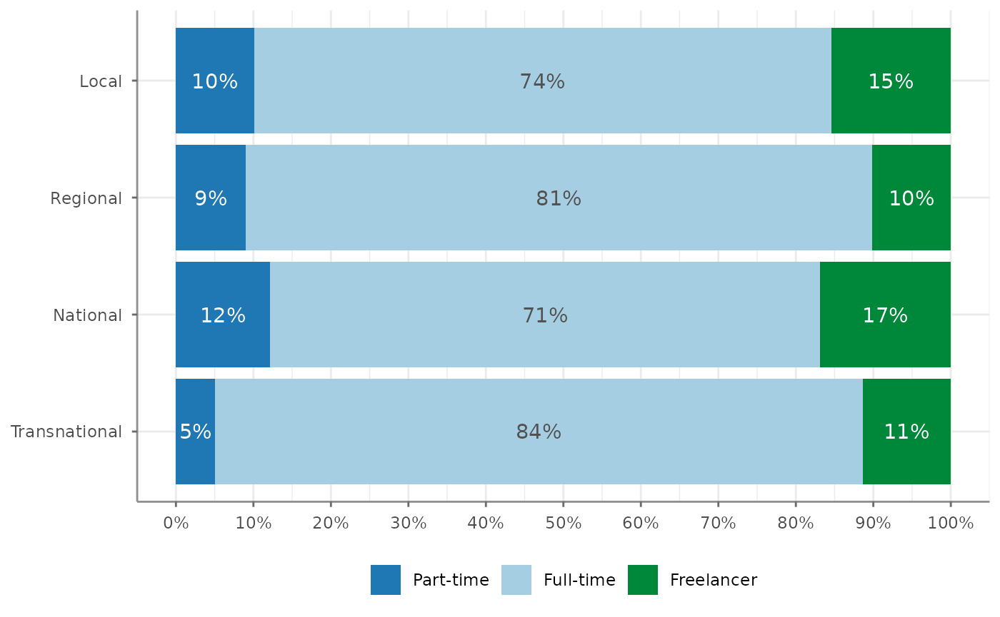

Note that the `percentages = TRUE` argument determines whether the bars
add up to 100% and thus cover the whole width or whether they do not:

``` r

WoJ %>% 
  crosstab(reach, employment) %>% 
  visualize()
```

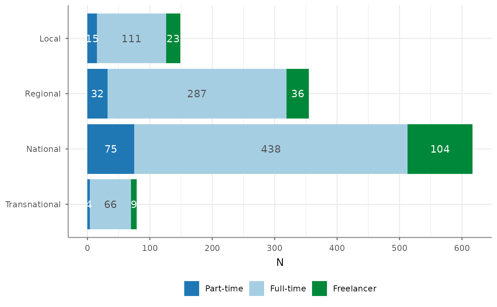

## Compute t-Tests

Use
[`t_test()`](https://github.com/tidycomm/tidycomm/reference/t_test.md)
to quickly compute t-Tests for a group variable and one or more test
variables. Output includes test statistics, descriptive statistics and
Cohen’s $`d`$ effect size estimates:

``` r

WoJ %>% 
  t_test(temp_contract, autonomy_selection, autonomy_emphasis)
#> # A tibble: 2 × 12
#>   Variable M_Permanent SD_Permanent M_Temporary SD_Temporary Delta_M     t    df
#> * <chr>      <num:.3!>    <num:.3!>   <num:.3!>    <num:.3!> <num:.> <num> <dbl>
#> 1 autonom…       3.910        0.755       3.698        0.932   0.212 1.627    56
#> 2 autonom…       4.124        0.768       3.887        0.870   0.237 2.171   995
#> # ℹ 4 more variables: p <num:.3!>, d <num:.3!>, Levene_p <dbl>, var_equal <chr>
```

Passing no test variables will compute t-Tests for all numerical
variables in the data:

``` r

WoJ %>% 
  t_test(temp_contract)
#> # A tibble: 11 × 12
#>    Variable     M_Permanent SD_Permanent M_Temporary SD_Temporary Delta_M      t
#>  * <chr>          <num:.3!>    <num:.3!>   <num:.3!>    <num:.3!> <num:.> <num:>
#>  1 autonomy_se…       3.910        0.755       3.698        0.932   0.212  1.627
#>  2 autonomy_em…       4.124        0.768       3.887        0.870   0.237  2.171
#>  3 ethics_1           1.568        0.850       1.981        0.990  -0.414 -3.415
#>  4 ethics_2           3.241        1.263       3.509        1.234  -0.269 -1.510
#>  5 ethics_3           2.369        1.121       2.283        0.928   0.086  0.549
#>  6 ethics_4           2.534        1.239       2.566        1.217  -0.032 -0.185
#>  7 work_experi…      17.707       10.540      11.283       11.821   6.424  4.288
#>  8 trust_parli…       3.073        0.797       3.019        0.772   0.054  0.480
#>  9 trust_gover…       2.870        0.847       2.642        0.811   0.229  1.918
#> 10 trust_parti…       2.430        0.724       2.358        0.736   0.072  0.703
#> 11 trust_polit…       2.533        0.707       2.396        0.689   0.136  1.369
#> # ℹ 5 more variables: df <dbl>, p <num:.3!>, d <num:.3!>, Levene_p <dbl>,
#> #   var_equal <chr>
```

If passing a group variable with more than two unique levels,
[`t_test()`](https://github.com/tidycomm/tidycomm/reference/t_test.md)
will produce a `warning` and default to the first two unique values. You
can manually define the levels by setting the `levels` argument:

``` r

WoJ %>% 
  t_test(employment, autonomy_selection, autonomy_emphasis)
#> Warning: employment has more than 2 levels, defaulting to first two (Full-time
#> and Part-time). Consider filtering your data or setting levels with the levels
#> argument
#> # A tibble: 2 × 12
#>   Variable     `M_Full-time` `SD_Full-time` `M_Part-time` `SD_Part-time` Delta_M
#> * <chr>            <num:.3!>      <num:.3!>     <num:.3!>      <num:.3!> <num:.>
#> 1 autonomy_se…         3.903          0.782         3.825          0.633   0.078
#> 2 autonomy_em…         4.118          0.781         4.016          0.759   0.102
#> # ℹ 6 more variables: t <num:.3!>, df <dbl>, p <num:.3!>, d <num:.3!>,
#> #   Levene_p <dbl>, var_equal <chr>

WoJ %>% 
  t_test(employment, autonomy_selection, autonomy_emphasis, levels = c("Full-time", "Freelancer"))
#> # A tibble: 2 × 12
#>   Variable `M_Full-time` `SD_Full-time` M_Freelancer SD_Freelancer Delta_M     t
#> * <chr>        <num:.3!>      <num:.3!>    <num:.3!>     <num:.3!> <num:.> <num>
#> 1 autonom…         3.903          0.782        3.765         0.993   0.139 1.724
#> 2 autonom…         4.118          0.781        3.901         0.852   0.217 3.287
#> # ℹ 5 more variables: df <dbl>, p <num:.3!>, d <num:.3!>, Levene_p <dbl>,
#> #   var_equal <chr>
```

Additional options include:

- `pooled_sd`: By default, the pooled variance will be used the compute
  Cohen’s $`d`$ effect size estimates
  ($`s = \sqrt\frac{(n_1 - 1)s^2_1 + (n_2 - 1)s^2_2}{n_1 + n_2 - 2}`$).
  Set `pooled_sd = FALSE` to use the simple variance estimation instead
  ($`s = \sqrt\frac{(s^2_1 + s^2_2)}{2}`$).
- `paired`: Set `paired = TRUE` to compute a paired t-Test instead. It
  is advisable to specify the case-identifying variable with `case_var`
  when computing paired t-Tests, as this will make sure that data are
  properly sorted.

Previously, the (now deprecated) option of `var.equal` was also
available. This has been overthrown, however, as
[`t_test()`](https://github.com/tidycomm/tidycomm/reference/t_test.md)
now by default tests for equal variance (using a Levene test) to decide
whether to use pooled variance or to use the Welch approximation to the
degrees of freedom.

[`t_test()`](https://github.com/tidycomm/tidycomm/reference/t_test.md)
also provides a one-sample t-Test if you provide a `mu` argument:

``` r

WoJ %>% 
  t_test(autonomy_emphasis, mu = 3.9)
#> # A tibble: 1 × 9
#>   Variable              M    SD CI_95_LL CI_95_UL    Mu     t    df        p
#> * <chr>             <dbl> <dbl>    <dbl>    <dbl> <dbl> <dbl> <dbl>    <dbl>
#> 1 autonomy_emphasis  4.08 0.793     4.03     4.12   3.9  7.68  1194 3.23e-14
```

Of course, also the result from t-Tests can be visualized easily as
such:

``` r

WoJ %>% 
  t_test(temp_contract, autonomy_selection, autonomy_emphasis) %>% 
  visualize()
```

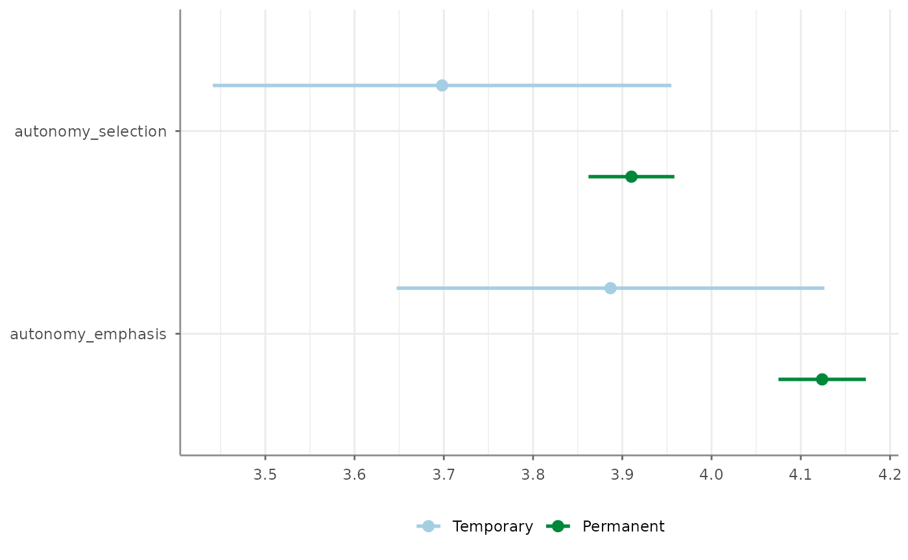

## Compute one-way ANOVAs

[`unianova()`](https://github.com/tidycomm/tidycomm/reference/unianova.md)
will compute one-way ANOVAs for one group variable and one or more test
variables. Output includes test statistics, $`\eta^2`$ effect size
estimates, and $`\omega^2`$, if Welch’s approximation is used to account
for unequal variances.

``` r

WoJ %>% 
  unianova(employment, autonomy_selection, autonomy_emphasis)
#> # A tibble: 2 × 9
#>   Variable            F df_num df_denom     p omega_squared eta_squared Levene_p
#> * <chr>           <num>  <dbl>    <dbl> <num>     <num:.3!>   <num:.3!>    <dbl>
#> 1 autonomy_selec… 2.012      2      251 0.136         0.002      NA        0    
#> 2 autonomy_empha… 5.861      2     1192 0.003        NA           0.010    0.175
#> # ℹ 1 more variable: var_equal <chr>
```

Descriptives can be added by setting `descriptives = TRUE`. If no test
variables are passed, all numerical variables in the data will be used:

``` r

WoJ %>% 
  unianova(employment, descriptives = TRUE)
#> # A tibble: 11 × 15
#>    Variable                  F df_num df_denom     p omega_squared `M_Full-time`
#>  * <chr>              <num:.3>  <dbl>    <dbl> <num>     <num:.3!>         <dbl>
#>  1 autonomy_selection    2.012      2      251 0.136         0.002          3.90
#>  2 autonomy_emphasis     5.861      2     1192 0.003        NA              4.12
#>  3 ethics_1              2.171      2     1197 0.115        NA              1.62
#>  4 ethics_2              2.204      2     1197 0.111        NA              3.24
#>  5 ethics_3              5.823      2      253 0.003         0.007          2.39
#>  6 ethics_4              3.453      2     1197 0.032        NA              2.58
#>  7 work_experience       3.739      2      240 0.025         0.006         17.5 
#>  8 trust_parliament      1.527      2     1197 0.218        NA              3.06
#>  9 trust_government     12.864      2     1197 0.000        NA              2.82
#> 10 trust_parties         0.842      2     1197 0.431        NA              2.42
#> 11 trust_politicians     0.328      2     1197 0.721        NA              2.52
#> # ℹ 8 more variables: `SD_Full-time` <dbl>, `M_Part-time` <dbl>,
#> #   `SD_Part-time` <dbl>, M_Freelancer <dbl>, SD_Freelancer <dbl>,
#> #   eta_squared <num:.3!>, Levene_p <dbl>, var_equal <chr>
```

You can also compute *Tukey’s HSD* post-hoc tests by setting
`post_hoc = TRUE`. Results will be added as a `tibble` in a list column
`post_hoc`.

``` r

WoJ %>% 
  unianova(employment, autonomy_selection, autonomy_emphasis, post_hoc = TRUE)
#> # A tibble: 2 × 10
#>   Variable            F df_num df_denom     p omega_squared post_hoc eta_squared
#> * <chr>           <num>  <dbl>    <dbl> <num>     <num:.3!> <list>     <num:.3!>
#> 1 autonomy_selec… 2.012      2      251 0.136         0.002 <df>          NA    
#> 2 autonomy_empha… 5.861      2     1192 0.003        NA     <df>           0.010
#> # ℹ 2 more variables: Levene_p <dbl>, var_equal <chr>
```

These can then be unnested with
[`tidyr::unnest()`](https://tidyr.tidyverse.org/reference/unnest.html):

``` r

WoJ %>% 
  unianova(employment, autonomy_selection, autonomy_emphasis, post_hoc = TRUE) %>% 
  dplyr::select(Variable, post_hoc) %>% 
  tidyr::unnest(post_hoc)
#> # A tibble: 6 × 11
#>   Variable      Group_Var contrast Delta_M conf_lower conf_upper       p       d
#>   <chr>         <chr>     <chr>      <dbl>      <dbl>      <dbl>   <dbl>   <dbl>
#> 1 autonomy_sel… employme… Full-ti… -0.0780     -0.225     0.0688 0.422   -0.110 
#> 2 autonomy_sel… employme… Full-ti… -0.139      -0.329     0.0512 0.199   -0.155 
#> 3 autonomy_sel… employme… Part-ti… -0.0607     -0.284     0.163  0.798   -0.0729
#> 4 autonomy_emp… employme… Full-ti… -0.102      -0.278     0.0741 0.362   -0.133 
#> 5 autonomy_emp… employme… Full-ti… -0.217      -0.372    -0.0629 0.00284 -0.266 
#> 6 autonomy_emp… employme… Part-ti… -0.115      -0.333     0.102  0.428   -0.143 
#> # ℹ 3 more variables: se <dbl>, t <dbl>, df <dbl>
```

Visualize one-way ANOVAs the way you visualize almost everything in
`tidycomm`:

``` r

WoJ %>% 
  unianova(employment, autonomy_selection, autonomy_emphasis) %>% 
  visualize()
```

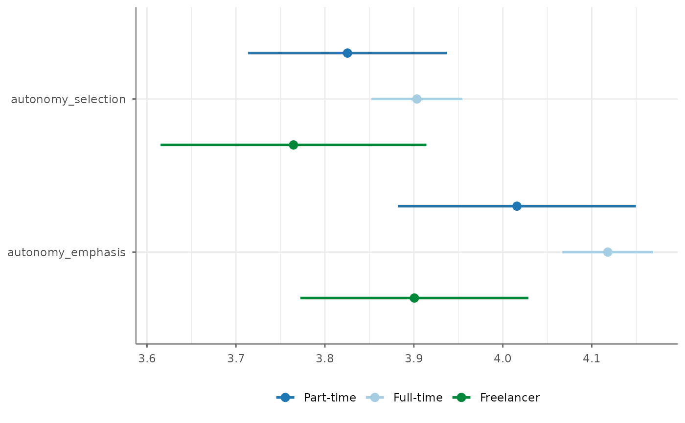

## Compute correlation tables and matrices

[`correlate()`](https://github.com/tidycomm/tidycomm/reference/correlate.md)
will compute correlations for all combinations of the passed variables:

``` r

WoJ %>% 
  correlate(work_experience, autonomy_selection, autonomy_emphasis)
#> # A tibble: 3 × 6
#>   x                  y                      r    df         p     n
#> * <chr>              <chr>              <dbl> <int>     <dbl> <int>
#> 1 work_experience    autonomy_selection 0.161  1182 2.71e-  8  1184
#> 2 work_experience    autonomy_emphasis  0.155  1180 8.87e-  8  1182
#> 3 autonomy_selection autonomy_emphasis  0.644  1192 4.83e-141  1194
```

If no variables passed, correlations for all combinations of numerical
variables will be computed:

``` r

WoJ %>% 
  correlate()
#> # A tibble: 55 × 6
#>    x                  y                        r    df         p     n
#>  * <chr>              <chr>                <dbl> <int>     <dbl> <int>
#>  1 autonomy_selection autonomy_emphasis  0.644    1192 4.83e-141  1194
#>  2 autonomy_selection ethics_1          -0.0766   1195 7.98e-  3  1197
#>  3 autonomy_selection ethics_2          -0.0274   1195 3.43e-  1  1197
#>  4 autonomy_selection ethics_3          -0.0257   1195 3.73e-  1  1197
#>  5 autonomy_selection ethics_4          -0.0781   1195 6.89e-  3  1197
#>  6 autonomy_selection work_experience    0.161    1182 2.71e-  8  1184
#>  7 autonomy_selection trust_parliament  -0.00840  1195 7.72e-  1  1197
#>  8 autonomy_selection trust_government   0.0414   1195 1.53e-  1  1197
#>  9 autonomy_selection trust_parties      0.0269   1195 3.52e-  1  1197
#> 10 autonomy_selection trust_politicians  0.0109   1195 7.07e-  1  1197
#> # ℹ 45 more rows
```

Specify a focus variable using the `with` parameter to correlate all
other variables with this focus variable.

``` r

WoJ %>% 
  correlate(autonomy_selection, autonomy_emphasis, with = work_experience)
#> # A tibble: 2 × 6
#>   x               y                      r    df            p     n
#> * <chr>           <chr>              <dbl> <int>        <dbl> <int>
#> 1 work_experience autonomy_selection 0.161  1182 0.0000000271  1184
#> 2 work_experience autonomy_emphasis  0.155  1180 0.0000000887  1182
```

Run a partial correlation by designating three variables along with the
`partial` parameter.

``` r

WoJ %>% 
  correlate(autonomy_selection, autonomy_emphasis, partial = work_experience)
#> # A tibble: 1 × 7
#>   x                  y                 z                 r    df         p     n
#> * <chr>              <chr>             <chr>         <dbl> <dbl>     <dbl> <int>
#> 1 autonomy_selection autonomy_emphasis work_experie… 0.637  1178 3.07e-135  1181
```

Visualize correlations by passing the results on to the
[`visualize()`](https://github.com/tidycomm/tidycomm/reference/visualize.md)
function:

``` r

WoJ %>% 
  correlate(work_experience, autonomy_selection) %>% 
  visualize()
```

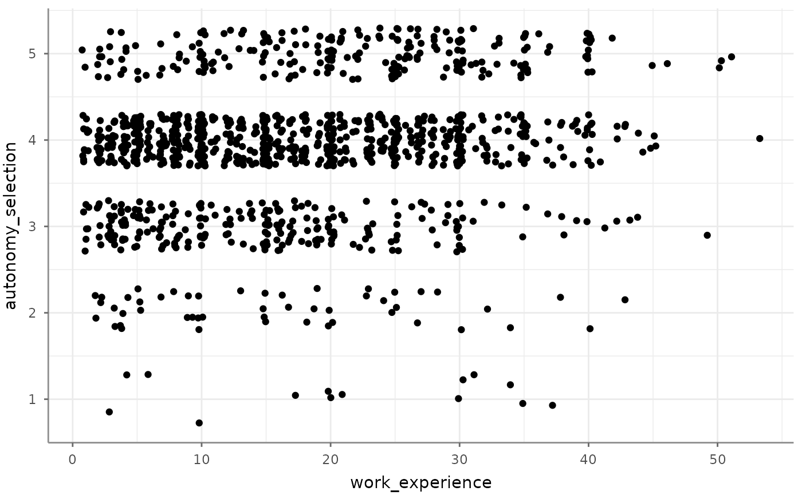

If you provide more than two variables, you automatically get a
correlogram (the same you would get if you convert correlations to a
correlation matrix):

``` r

WoJ %>% 
  correlate(work_experience, autonomy_selection, autonomy_emphasis) %>% 
  visualize()
```

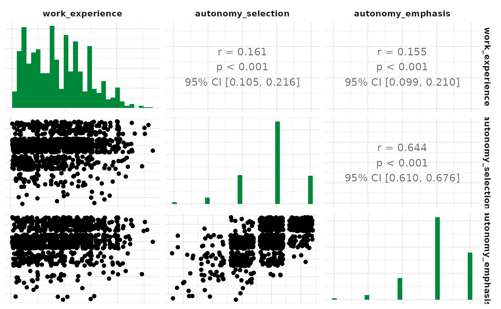

By default, Pearson’s product-moment correlations coefficients ($`r`$)
will be computed. Set `method` to `"kendall"` to obtain Kendall’s
$`\tau`$ or to `"spearman"` to obtain Spearman’s $`\rho`$ instead.

To obtain a correlation matrix, pass the output of
[`correlate()`](https://github.com/tidycomm/tidycomm/reference/correlate.md)
to
[`to_correlation_matrix()`](https://github.com/tidycomm/tidycomm/reference/to_correlation_matrix.md):

``` r

WoJ %>% 
  correlate(work_experience, autonomy_selection, autonomy_emphasis) %>% 
  to_correlation_matrix()
#> # A tibble: 3 × 4
#>   r                  work_experience autonomy_selection autonomy_emphasis
#> * <chr>                        <dbl>              <dbl>             <dbl>
#> 1 work_experience              1                  0.161             0.155
#> 2 autonomy_selection           0.161              1                 0.644
#> 3 autonomy_emphasis            0.155              0.644             1
```

## Compute linear regressions

[`regress()`](https://github.com/tidycomm/tidycomm/reference/regress.md)
will create a linear regression on one dependent variable with a
flexible number of independent variables. Independent variables can
thereby be continuous, dichotomous, and factorial (in which case each
factor level will be translated into a dichotomous dummy variable
version):

``` r

WoJ %>% 
  regress(autonomy_selection, work_experience, trust_government)
#> # A tibble: 3 × 6
#>   Variable              B  StdErr    beta     t         p
#> * <chr>             <dbl>   <dbl>   <dbl> <dbl>     <dbl>
#> 1 (Intercept)      3.52   0.0906  NA      38.8  3.02e-213
#> 2 work_experience  0.0121 0.00211  0.164   5.72 1.35e-  8
#> 3 trust_government 0.0501 0.0271   0.0531  1.85 6.49e-  2
#> # F(2, 1181) = 17.400584, p = 0.000000, R-square = 0.028624
```

The function automatically adds standardized beta values to the expected
linear-regression output. You can also opt in to calculate up to three
precondition checks:

``` r

WoJ %>% 
  regress(autonomy_selection, work_experience, trust_government,
          check_independenterrors = TRUE,
          check_multicollinearity = TRUE,
          check_homoscedasticity = TRUE)
#> # A tibble: 3 × 8
#>   Variable              B  StdErr    beta     t         p   VIF    TOL
#> * <chr>             <dbl>   <dbl>   <dbl> <dbl>     <dbl> <dbl>  <dbl>
#> 1 (Intercept)      3.52   0.0906  NA      38.8  3.02e-213 NA    NA    
#> 2 work_experience  0.0121 0.00211  0.164   5.72 1.35e-  8  1.01  0.995
#> 3 trust_government 0.0501 0.0271   0.0531  1.85 6.49e-  2  1.01  0.995
#> # F(2, 1181) = 17.400584, p = 0.000000, R-square = 0.028624
#> - Check for independent errors: Durbin-Watson = 1.928431 (p = 0.244000)
#> - Check for homoscedasticity: Breusch-Pagan = 0.181605 (p = 0.669997)
#> - Check for multicollinearity: VIF/tolerance added to output
```

For linear regressions, a number of visualizations are possible. The
default one is the visualization of the result(s), is that the dependent
variable is correlated with each of the independent variables separately
and a linear model is presented in these:

``` r

WoJ %>% 
  regress(autonomy_selection, work_experience, trust_government) %>% 
  visualize()
```

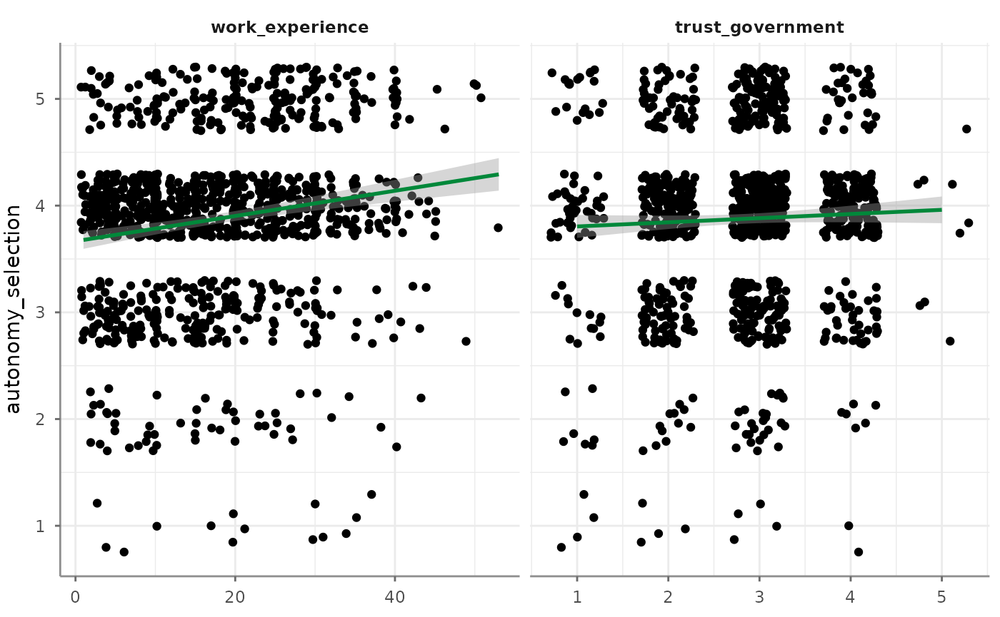

Alternatively you can visualize precondition-check-assisting depictions.
Correlograms among independent variables, for example:

``` r

WoJ %>% 
  regress(autonomy_selection, work_experience, trust_government) %>% 
  visualize(which = "correlogram")
```

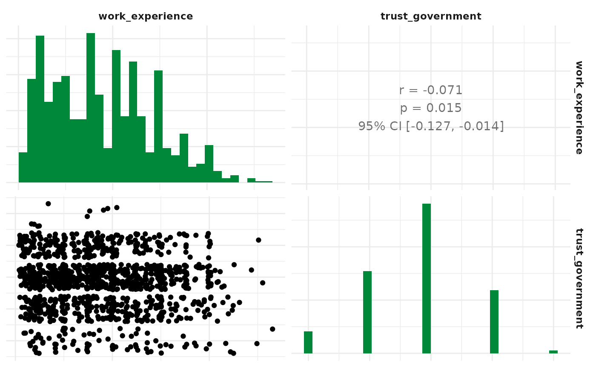

Next up, visualize a residuals-versus-fitted plot to determine
distributions:

``` r

WoJ %>% 
  regress(autonomy_selection, work_experience, trust_government) %>% 
  visualize(which = "resfit")
#> Warning: `fortify(<lm>)` was deprecated in ggplot2 4.0.0.
#> ℹ Please use `broom::augment(<lm>)` instead.
#> ℹ The deprecated feature was likely used in the tidycomm package.
#>   Please report the issue at <https://github.com/tidycomm/tidycomm/issues>.
#> This warning is displayed once per session.
#> Call `lifecycle::last_lifecycle_warnings()` to see where this warning was
#> generated.
```

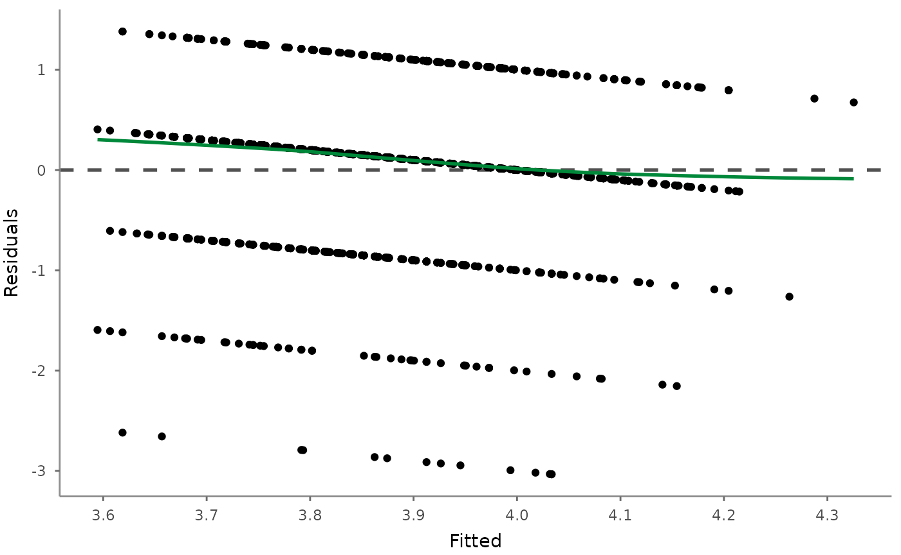

Or use a (normal) probability-probability plot to check for
multicollinearity:

``` r

WoJ %>% 
  regress(autonomy_selection, work_experience, trust_government) %>% 
  visualize(which = "pp")
```

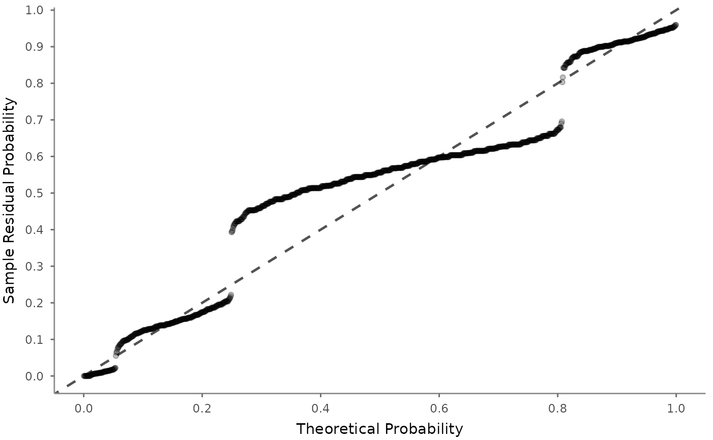

The (normal) quantile-quantile plot also helps checking for
multicollinearity but focuses more on outliers:

``` r

WoJ %>% 
  regress(autonomy_selection, work_experience, trust_government) %>% 
  visualize(which = "qq")
```

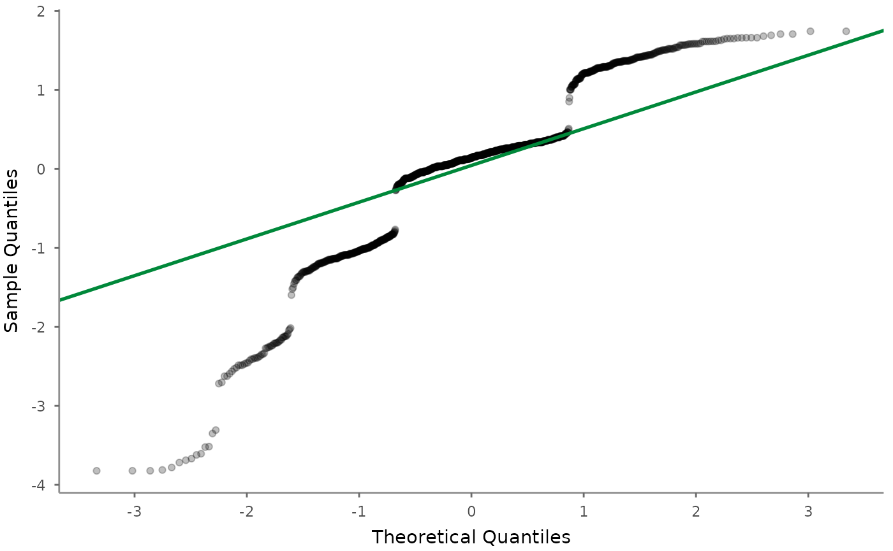

Next up, the scale-location (sometimes also called spread-location) plot
checks whether residuals are spread equally to help check for
homoscedasticity:

``` r

WoJ %>% 
  regress(autonomy_selection, work_experience, trust_government) %>% 
  visualize(which = "scaloc")
```

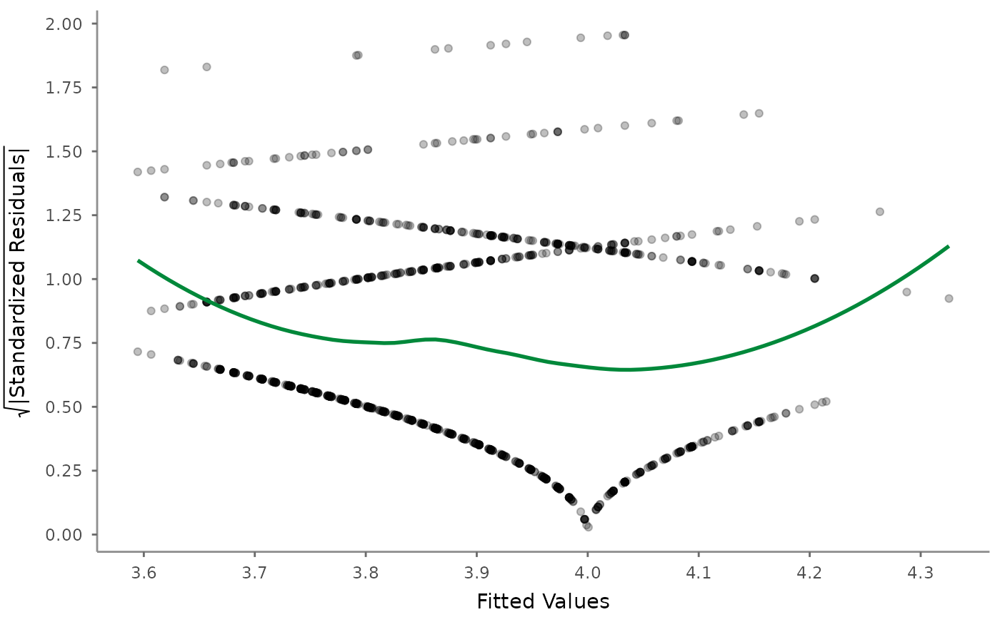

Finally, visualize the residuals-versus-leverage plot to check for
influential outliers affecting the final model more than the rest of the
data:

``` r

WoJ %>% 
  regress(autonomy_selection, work_experience, trust_government) %>% 
  visualize(which = "reslev")
```

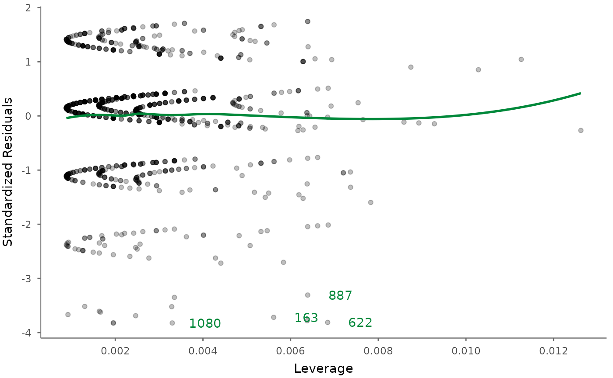
