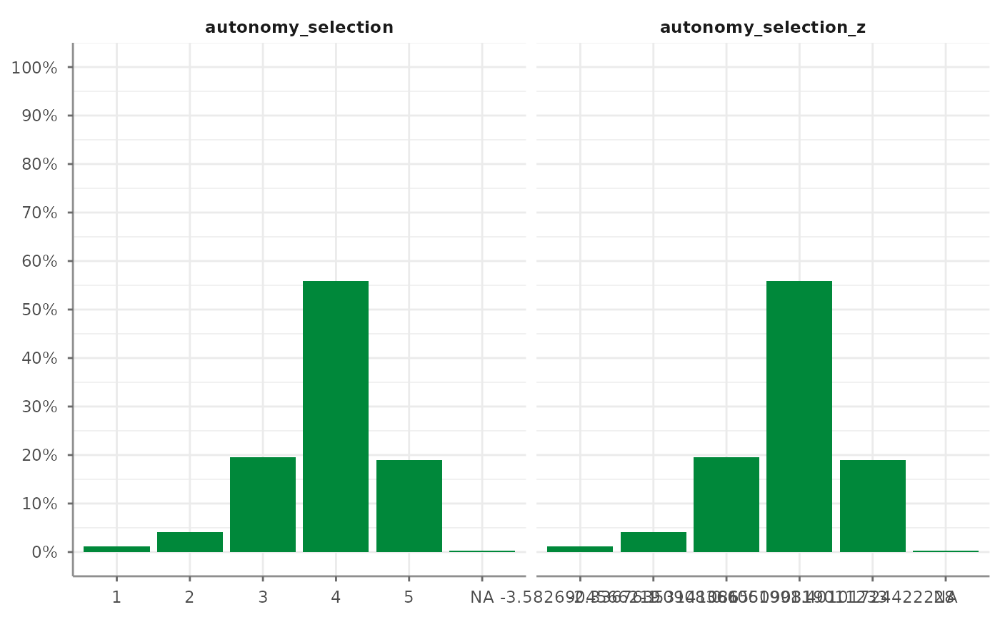

# Change Scales

Tidycomm provides four functions to easily transform continuous scales
and to standardize them:

- [`reverse_scale()`](https://github.com/tidycomm/tidycomm/reference/reverse_scale.md)
  simply turns a scale upside down
- [`minmax_scale()`](https://github.com/tidycomm/tidycomm/reference/minmax_scale.md)
  down- or upsizes a scale to new minimum/maximum while retaining
  distances
- [`center_scale()`](https://github.com/tidycomm/tidycomm/reference/center_scale.md)
  subtracts the mean from each individual data point to center a scale
  at a mean of 0
- [`z_scale()`](https://github.com/tidycomm/tidycomm/reference/z_scale.md)
  works just like
  [`center_scale()`](https://github.com/tidycomm/tidycomm/reference/center_scale.md)
  but also divides the result by the standard deviation to also obtain a
  standard deviation of 1 and make it comparable to other z-standardized
  distributions
- [`setna_scale()`](https://github.com/tidycomm/tidycomm/reference/setna_scale.md):
  Sets specified values to `NA` in selected variables or the entire data
  frame.
- [`recode_cat_scale()`](https://github.com/tidycomm/tidycomm/reference/recode_cat_scale.md):
  Recodes categorical variables based on provided assignments.
- [`categorize_scale()`](https://github.com/tidycomm/tidycomm/reference/categorize_scale.md):
  Recodes numeric scales into categorical variables based on provided
  breaks and labels.
- [`dummify_scale()`](https://github.com/tidycomm/tidycomm/reference/dummify_scale.md):
  Transforms categorical variables into dummy variables.

These functions provide convenience wrappers that make it easy to read
and spell out how you transformed your scales.

``` r

library(tidycomm)
```

The easiest one is to reverse your scale. You can just specify the scale
and define the scale’s lower and upper end. Take `autonomy_emphasis` as
an example that originally ranges from 1 to 5. We will reverse it to
range from 5 to 1.

The function adds a new column named `autonomy_emphasis_rev`:

``` r

WoJ %>% 
  reverse_scale(autonomy_emphasis,
                lower_end = 1,
                upper_end = 5) %>% 
  dplyr::select(autonomy_emphasis,
                autonomy_emphasis_rev)
#> # A tibble: 1,200 × 2
#>    autonomy_emphasis autonomy_emphasis_rev
#>                <dbl>                 <dbl>
#>  1                 4                     2
#>  2                 4                     2
#>  3                 4                     2
#>  4                 5                     1
#>  5                 4                     2
#>  6                 4                     2
#>  7                 4                     2
#>  8                 3                     3
#>  9                 5                     1
#> 10                 4                     2
#> # ℹ 1,190 more rows
```

Alternatively, you can also specify the new column name manually:

``` r

WoJ %>% 
  reverse_scale(autonomy_emphasis,
                name = "new_emphasis",
                lower_end = 1,
                upper_end = 5) %>% 
  dplyr::select(autonomy_emphasis,
                new_emphasis)
#> # A tibble: 1,200 × 2
#>    autonomy_emphasis new_emphasis
#>                <dbl>        <dbl>
#>  1                 4            2
#>  2                 4            2
#>  3                 4            2
#>  4                 5            1
#>  5                 4            2
#>  6                 4            2
#>  7                 4            2
#>  8                 3            3
#>  9                 5            1
#> 10                 4            2
#> # ℹ 1,190 more rows
```

[`minmax_scale()`](https://github.com/tidycomm/tidycomm/reference/minmax_scale.md)
just takes your continuous scale to a new range. For example, convert
the 1-5 scale of `autonomy_emphasis` to a 1-10 scale while keeping the
distances:

``` r

WoJ %>% 
  minmax_scale(autonomy_emphasis,
               change_to_min = 1,
               change_to_max = 10) %>% 
  dplyr::select(autonomy_emphasis,
                autonomy_emphasis_1to10)
#> # A tibble: 1,200 × 2
#>    autonomy_emphasis autonomy_emphasis_1to10
#>                <dbl>                   <dbl>
#>  1                 4                    7.75
#>  2                 4                    7.75
#>  3                 4                    7.75
#>  4                 5                   10   
#>  5                 4                    7.75
#>  6                 4                    7.75
#>  7                 4                    7.75
#>  8                 3                    5.5 
#>  9                 5                   10   
#> 10                 4                    7.75
#> # ℹ 1,190 more rows
```

[`center_scale()`](https://github.com/tidycomm/tidycomm/reference/center_scale.md)
moves your continuous scale around a mean of 0:

``` r

WoJ %>% 
  center_scale(autonomy_selection) %>% 
  dplyr::select(autonomy_selection,
                autonomy_selection_centered)
#> # A tibble: 1,200 × 2
#>    autonomy_selection autonomy_selection_centered
#>                 <dbl>                       <dbl>
#>  1                  5                       1.12 
#>  2                  3                      -0.876
#>  3                  4                       0.124
#>  4                  4                       0.124
#>  5                  4                       0.124
#>  6                  4                       0.124
#>  7                  4                       0.124
#>  8                  3                      -0.876
#>  9                  5                       1.12 
#> 10                  2                      -1.88 
#> # ℹ 1,190 more rows
```

Finally,
[`z_scale()`](https://github.com/tidycomm/tidycomm/reference/z_scale.md)
does more or less the same but standardizes the outcome. To visualize
this, we look at it with a visualized
[`tab_frequencies()`](https://github.com/tidycomm/tidycomm/reference/tab_frequencies.md):

``` r

WoJ %>% 
  z_scale(autonomy_selection) %>% 
  tab_frequencies(autonomy_selection,
                  autonomy_selection_z) %>% 
  visualize()
```



To set a specific value to `NA`:

``` r

WoJ %>% 
  setna_scale(autonomy_emphasis, value = 5) %>% 
  dplyr::select(autonomy_emphasis, autonomy_emphasis_na)
#> # A tibble: 1,200 × 2
#>    autonomy_emphasis autonomy_emphasis_na
#>                <dbl>                <dbl>
#>  1                 4                    4
#>  2                 4                    4
#>  3                 4                    4
#>  4                 5                   NA
#>  5                 4                    4
#>  6                 4                    4
#>  7                 4                    4
#>  8                 3                    3
#>  9                 5                   NA
#> 10                 4                    4
#> # ℹ 1,190 more rows
```

For recoding categorical scales:

``` r

WoJ %>% 
  dplyr::select(country) %>%
  recode_cat_scale(country, assign = c("Germany" = "german", "Switzerland" = "swiss"), other = "other")
#> The following unassigned values were found in country : Austria, Denmark, UK . They were recoded to the 'other' value ( other ).
#> # A tibble: 1,200 × 2
#>    country     country_rec
#>  * <fct>       <fct>      
#>  1 Germany     german     
#>  2 Germany     german     
#>  3 Switzerland swiss      
#>  4 Switzerland swiss      
#>  5 Austria     other      
#>  6 Switzerland swiss      
#>  7 Germany     german     
#>  8 Denmark     other      
#>  9 Switzerland swiss      
#> 10 Denmark     other      
#> # ℹ 1,190 more rows
```

To recode numeric scales into categories:

``` r

WoJ %>%
  dplyr::select(autonomy_emphasis) %>%
  categorize_scale(autonomy_emphasis, 
               lower_end =1, upper_end =5,
               breaks = c(2, 3),
               labels = c("Low", "Medium", "High"))
#> # A tibble: 1,200 × 2
#>    autonomy_emphasis autonomy_emphasis_cat
#>  *             <dbl> <fct>                
#>  1                 4 High                 
#>  2                 4 High                 
#>  3                 4 High                 
#>  4                 5 High                 
#>  5                 4 High                 
#>  6                 4 High                 
#>  7                 4 High                 
#>  8                 3 Medium               
#>  9                 5 High                 
#> 10                 4 High                 
#> # ℹ 1,190 more rows
```

And to create dummy variables:

``` r

WoJ %>% 
  dplyr::select(temp_contract) %>%
  dummify_scale(temp_contract)
#> # A tibble: 1,200 × 3
#>    temp_contract temp_contract_permanent temp_contract_temporary
#>  * <fct>                           <int>                   <int>
#>  1 Permanent                           1                       0
#>  2 Permanent                           1                       0
#>  3 Permanent                           1                       0
#>  4 Permanent                           1                       0
#>  5 Permanent                           1                       0
#>  6 NA                                 NA                      NA
#>  7 Permanent                           1                       0
#>  8 Permanent                           1                       0
#>  9 Permanent                           1                       0
#> 10 Permanent                           1                       0
#> # ℹ 1,190 more rows
```
